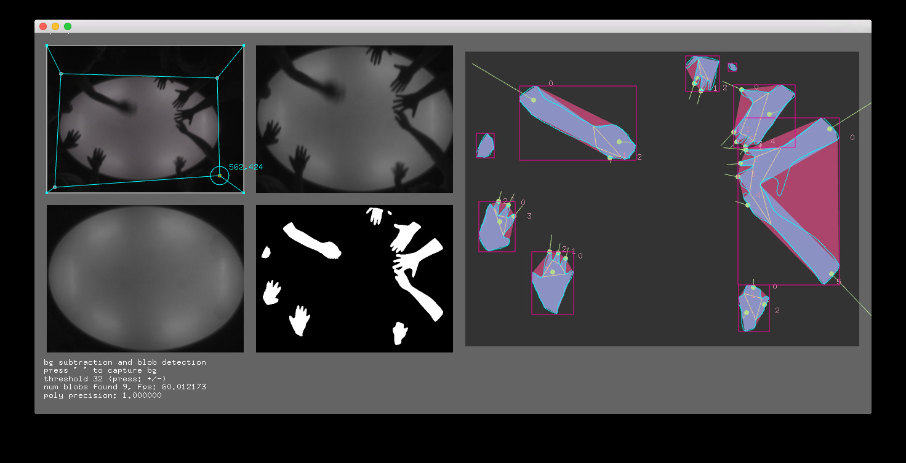

# gallery-tools
multi-project tools for openframeworks development

## ofxQuadWarper

An openframeworks addon that makes it easier to interactively load save and edit arbitrary quads for the purpose of warping 2D camera images.
